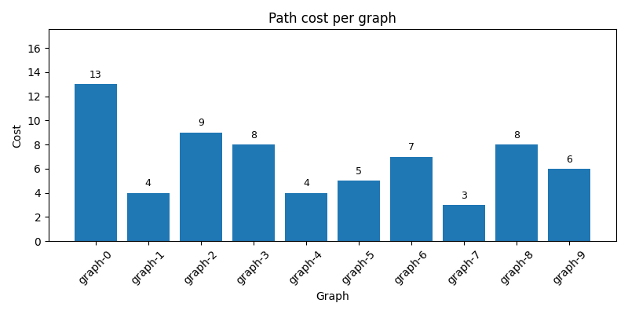
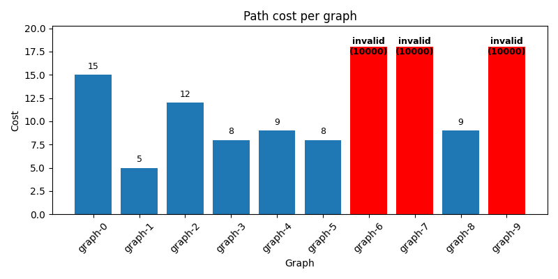

# Evaluation

For each graph:
- the submitted path is checked for validity
- its total cost is computed

A submission is considered invalid for a graph if:
- the path is empty
- the path does not start at the source
- the path does not end at the target
- the path uses an edge that does not exist in the graph

**Warning:** if a path is invalid, the cost for this graph will be set to **1000** as a penalty.

The final score is the average path cost over all graphs. Lower cost is better.

## Detailed results

In the "detailed results" of each submission, you can find a figure reporting the cost score for each graph:

Penalty are displayed in red:

