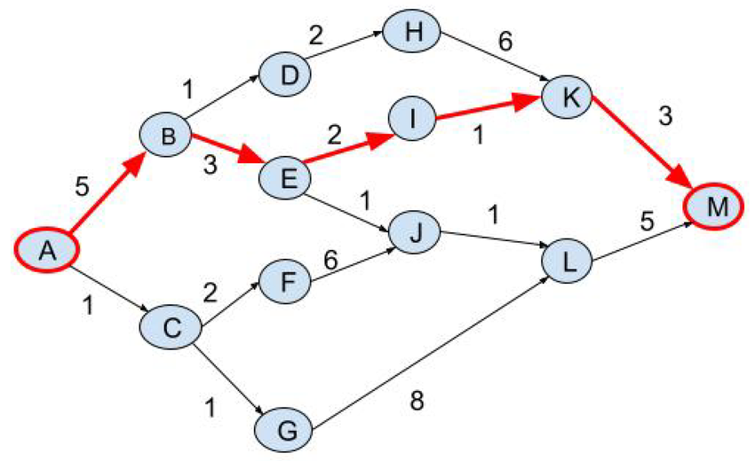

# Overview

Welcome to the **Shortest Path on Weighted Graph** challenge.

The goal of this challenge is to design an algorithm that finds a low-cost path between a given **source** node and a given **target** node in a weighted graph.

The cost of a path is the sum of the weights of its edges. The objective is therefore to find a path with the **smallest possible total cost**.

This benchmark is intentionally simple and is meant as an example of an optimization challenge on Codabench. It shows how to submit code that solves a combinatorial optimization problem, rather than a standard machine learning prediction task.

## Task

For each graph in the dataset, your algorithm must output one path from the source node to the target node.

## Evaluation

For each graph:
- the submitted path is checked for validity
- its total cost is computed

The final score is based on the average path cost over all graphs. Lower cost is better.

## Baselines

The starting kit provides example solvers, including:
- a simple random-path baseline
- a Dijkstra baseline

These baselines are provided to illustrate the expected interface and output format.

## Credit

This Codabench template bundle was made by [Adrien Pavão](https://adrienpavao.com/)
